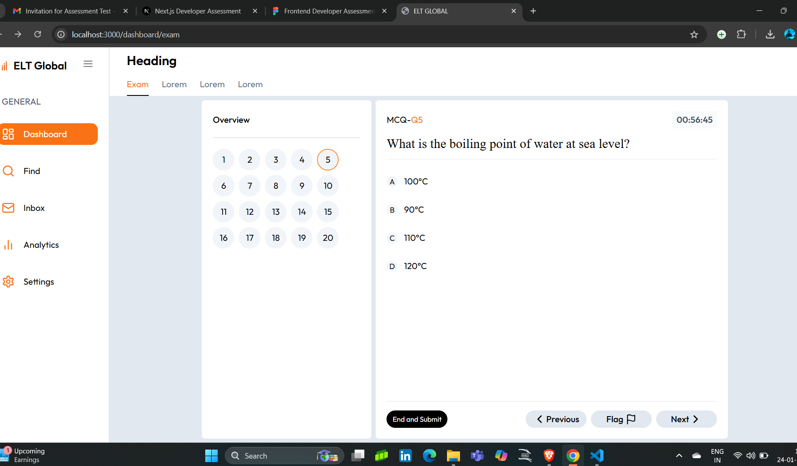
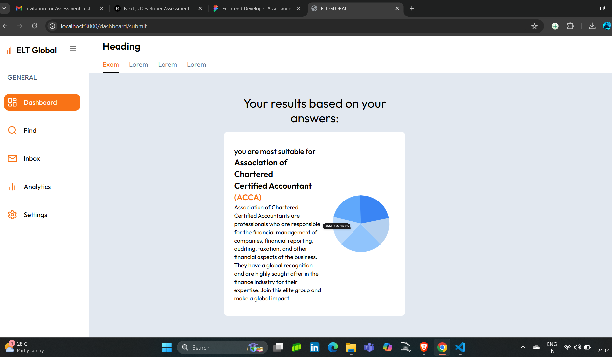

# Project Documentation

## Images

### Image 1


### Image 2


### Image 3


## Notes
- Ensure that these image paths are correct relative to the `README.md` file's location in the project.
- If you're using Next.js, you might want to move these images to the `public` directory and reference them like so:
  ```markdown
  
  
  
  # ELT Global Project

This is a Next.js project designed to demonstrate functionality for generating and displaying outputs such as images.

---

## Table of Contents
1. [Installation](#installation)
2. [Running the Application](#running-the-application)
3. [Images](#images)
4. [Project Structure](#project-structure)

---

## Installation

Follow these steps to set up the project:

1. Clone the repository:
   ```bash
   git clone https://github.com/vasanth27s/elt-global.git
2. installation of the ELT Glogal:
   npm install
3. Run Command:
   npm run dev
